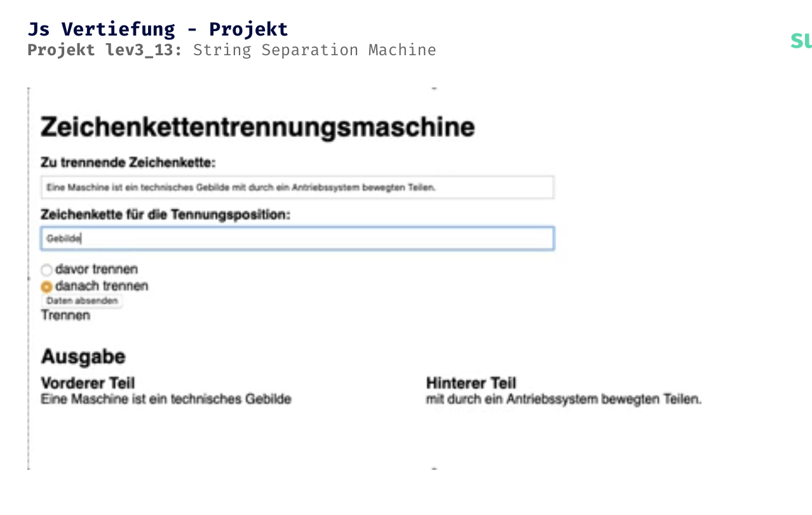

CSS Vertiefung - Lev3_13_Project-js-vertiefung

Eine Übung im SuperCode Bootcamp

## 🎓 Aufgabe

Aufgabenstellung

Erstelle mit Javascript eine Zeichenkettentrennungsmaschine.
Diese sollte wie auf der folgenden Folie aussehen.

## 📸 Screenshots

## 💻 Running

Zur Seite —> - [Lev3_13_Project_js-vertiefung](https://jennijennina.github.io/Zeichenkettentrennungsmaschine/)

<h3 align="left">Languages and Tools:</h3>

 
 
 

